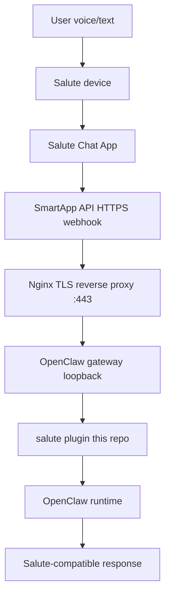

# SaluteClaw

`SaluteClaw` connects a Salute `Chat App` (scenario type `SmartApp API`) to a personal OpenClaw server through a standalone `salute` plugin.

## What This Repo Contains

- OpenClaw plugin source in `plugin/`
- Salute inbound/outbound mapping logic
- Runtime handoff and background result cache
- Salute webhook fixtures in `fixtures/salute/`
- Setup and architecture docs for OpenClaw and Salute Studio

## Runtime Flow



## Current Response Model (Important)

Salute SmartApp API has a strict synchronous webhook timeout, while tool-enabled runs can take much longer. The plugin uses a two-phase model:

1. Return a fast reply immediately (`disableTools: true`).
2. Start a full tool-enabled run in background (`disableTools: false`).
3. On the next user turn, prepend the cached background result (if ready) before the new fast reply.

This introduces a one-message delay for richer tool-based results, but keeps webhook latency low and reliable.

## Quick Validation

Use the provided fixtures against your public webhook:

```bash
curl -i -X POST "https://your-domain.example/salute/webhook" \
  -H "content-type: application/json" \
  --data @/root/SaluteClaw/fixtures/salute/launch.json

curl -i -X POST "https://your-domain.example/salute/webhook" \
  -H "content-type: application/json" \
  --data @/root/SaluteClaw/fixtures/salute/message.json

curl -i -X POST "https://your-domain.example/salute/webhook" \
  -H "content-type: application/json" \
  --data @/root/SaluteClaw/fixtures/salute/close.json
```

Inspect plugin registration:

```bash
openclaw plugins inspect salute --json
```

## Documentation

- `SPEC.md` - full technical specification and decisions
- `docs/overview.md` - project scope and current status
- `docs/architecture.md` - runtime topology and request lifecycle
- `docs/setup-openclaw.md` - OpenClaw configuration and plugin loading
- `docs/setup-salute.md` - Salute SmartApp setup
- `docs/poc-plan.md` - phased implementation plan
