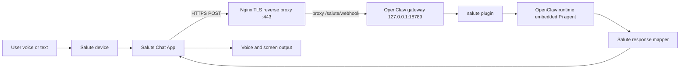
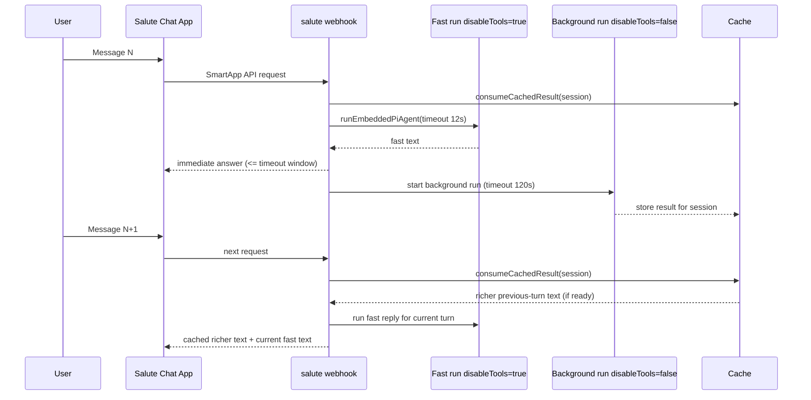

# SaluteClaw Architecture

## Runtime Topology
The integration runs as a local OpenClaw plugin loaded from this repository.

## Two-Phase Message Lifecycle

## Plugin Registration
`plugin/index.ts` performs registration and route wiring:

- registers channel via `api.registerChannel({ plugin: saluteChannel })`
- stores runtime handle with `setRuntime(api.runtime)`
- skips webhook route registration in non-full registration modes
- enumerates account ids from config and registers one route per account
- uses route auth mode `plugin` and exact path matching

## Implemented Module Roles
- `src/channel.ts` - channel metadata/capabilities and config helpers
- `src/config.ts` - account listing, resolution, and inspect info
- `src/webhook.ts` - request body parsing, dispatch, timeout wrapper, fallback responses
- `src/inbound.ts` - messageName mapping into normalized envelope
- `src/runtime.ts` - OpenClaw runtime handoff for fast and background agent runs
- `src/cache.ts` - in-memory TTL cache for background results
- `src/outbound.ts` - Salute response shape builders
- `src/mapper.ts` - sanitization, null stripping, and text truncation
- `src/types.ts` - Salute payload and plugin/runtime TypeScript interfaces

## Inbound Processing
`src/webhook.ts` handles multiple body shapes used by OpenClaw gateway and Node request wrappers:

- object, string, `Uint8Array`, serialized `Buffer` objects
- nested fields (`body`, `payload`, `data`, `message`, etc.)
- optional `req.json()` / `req.text()`
- Node stream body via `data`/`end`

Then `src/inbound.ts` maps Salute message names:

- `RUN_APP` -> `launch`
- `MESSAGE_TO_SKILL` -> `message`
- `SERVER_ACTION` -> `action`
- `CLOSE_APP` -> `close`

Normalized envelope fields:
- `accountId`
- `sessionId`
- `userId` (derived from `uuid.sub`/`uuid.userId`)
- `chatId`
- `requestType`
- optional `text` / `actionId`
- original raw request

## Request Handling Logic
Webhook behavior by request type:

- `launch`: returns greeting response with `auto_listening: true`
- `close`: evicts session cache entry and returns goodbye response (`finished: true`)
- `message` / `action`:
  - if no text: asks user to repeat
  - else: consumes cached background result (if present), gets fast runtime reply, optionally prepends cached text, returns answer
  - starts a new background full-agent run for this turn
- any unexpected failure: returns short safe fallback, logs details server-side

Handler timeout for runtime call path is capped with `withTimeout(..., 15000)`.

## Two-Phase Runtime Model
Implemented in `src/runtime.ts`:

- **Fast path (immediate response)**
  - `timeoutMs: 12000`
  - `disableTools: true`
  - `bootstrapContextMode: "lightweight"`
  - `fastMode: true`
- **Background path (next-turn richer response)**
  - `timeoutMs: 120000`
  - `disableTools: false`
  - `bootstrapContextMode: "full"`
  - `fastMode: false`

Both use provider/model profile:

- provider: `openai-codex`
- model: `gpt-5.3-codex-spark`
- auth profile: `openai-codex:default`

## Background Result Cache
`src/cache.ts` provides session-scoped in-memory caching:

- cache key format: `salute:{accountId}:{sessionId}`
- TTL: 10 minutes
- eviction sweep: every 60 seconds
- `storePendingRun()` tracks active background promise
- `consumeCachedResult()` atomically returns and removes ready result
- `evictSession()` clears entries on `CLOSE_APP`
- newer pending runs replace older pending runs for same session key

## Outbound Mapping Rules
`src/outbound.ts` and `src/mapper.ts` enforce Salute-safe responses:

- `messageName` set to `ANSWER_TO_USER`
- spoken text sanitized and truncated to 1024 chars
- bubble text truncated to 2048 chars
- null/undefined fields removed before serialization
- optional suggestions rendered as Salute text buttons with backend roundtrip
- deterministic Russian fallback strings for errors and no-text cases

## Constraints and Implications
- SmartApp API flow is synchronous; no server push into active session
- richer tool-enabled answer appears on next user turn
- this trades some conversational immediacy for deterministic webhook latency
