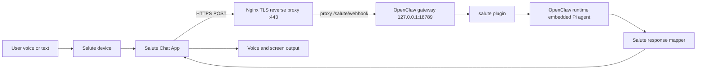
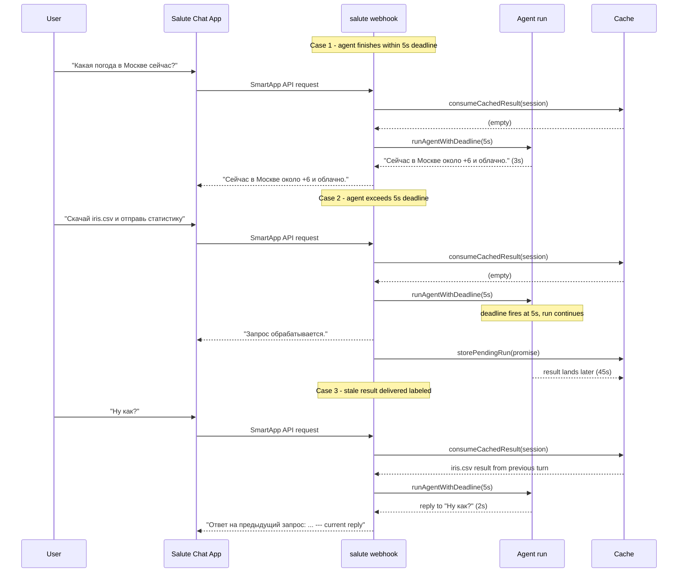

# SaluteClaw Architecture

## Runtime Topology
The integration runs as a local OpenClaw plugin loaded from this repository.

## Wait-with-Deadline Message Lifecycle

## Plugin Registration
`plugin/index.ts` performs registration and route wiring:

- registers channel via `api.registerChannel({ plugin: saluteChannel })`
- stores runtime handle with `setRuntime(api.runtime)`
- skips webhook route registration in non-full registration modes
- enumerates account ids from config and registers one route per account
- uses route auth mode `plugin` and exact path matching

## Implemented Module Roles
- `src/channel.ts` - channel metadata/capabilities and config helpers
- `src/config.ts` - account listing, resolution, and inspect info
- `src/webhook.ts` - request body parsing, dispatch, wait-with-deadline orchestration, fallback responses
- `src/inbound.ts` - messageName mapping into normalized envelope
- `src/runtime.ts` - OpenClaw runtime handoff with deadline race and background caching
- `src/cache.ts` - in-memory TTL cache for background results
- `src/outbound.ts` - Salute response shape builders
- `src/mapper.ts` - sanitization, null stripping, and text truncation
- `src/types.ts` - Salute payload and plugin/runtime TypeScript interfaces

## Inbound Processing
`src/webhook.ts` handles multiple body shapes used by OpenClaw gateway and Node request wrappers:

- object, string, `Uint8Array`, serialized `Buffer` objects
- nested fields (`body`, `payload`, `data`, `message`, etc.)
- optional `req.json()` / `req.text()`
- Node stream body via `data`/`end`

Then `src/inbound.ts` maps Salute message names:

- `RUN_APP` -> `launch`
- `MESSAGE_TO_SKILL` -> `message`
- `SERVER_ACTION` -> `action`
- `CLOSE_APP` -> `close`

Normalized envelope fields:
- `accountId`
- `sessionId`
- `userId` (derived from `uuid.sub`/`uuid.userId`)
- `chatId`
- `requestType`
- optional `text` / `actionId`
- original raw request

## Request Handling Logic
Webhook behavior by request type:

- `launch`: returns greeting response with `auto_listening: true`
- `close`: evicts session cache entry and returns goodbye response (`finished: true`)
- `message` / `action`:
  - if no text: asks user to repeat
  - else:
    1. consume any stale cached result from a previous turn
    2. start agent run and race it against a 5-second deadline
    3. if agent finishes within deadline: use its text as the reply
    4. if deadline fires first: reply with "Запрос обрабатывается.", stash the still-running promise in cache for next turn
    5. if a stale result was consumed in step 1, prepend it labeled ("Ответ на предыдущий запрос: ...")
- any unexpected failure: returns short safe fallback, logs details server-side

## Agent Run with Deadline
Implemented in `src/runtime.ts` via `runAgentWithDeadline()`:

- starts `runEmbeddedPiAgent` with full tool access
- races the agent promise against a `WEBHOOK_DEADLINE_MS` (5s) timer
- if agent wins: returns `{ text, timedOut: false }`
- if deadline wins: stores the still-running promise in cache via `storePendingRun`, returns `{ text: undefined, timedOut: true }`

Agent parameters:

- `timeoutMs: 120000`
- `disableTools: false`
- `bootstrapContextMode: "full"`
- `fastMode: false`
- provider: `openai-codex`, model: `gpt-5.3-codex-spark`, auth: `openai-codex:default`

## Background Result Cache
`src/cache.ts` provides session-scoped in-memory caching:

- cache key format: `salute:{accountId}:{sessionId}`
- TTL: 10 minutes
- eviction sweep: every 60 seconds
- `storePendingRun()` tracks a background promise; skips store if one is already in-flight (no replacement)
- `consumeCachedResult()` atomically returns and removes a ready result
- `evictSession()` clears entries on `CLOSE_APP`

## Outbound Mapping Rules
`src/outbound.ts` and `src/mapper.ts` enforce Salute-safe responses:

- `messageName` set to `ANSWER_TO_USER`
- spoken text sanitized and truncated to 1024 chars
- bubble text truncated to 2048 chars
- null/undefined fields removed before serialization
- optional suggestions rendered as Salute text buttons with backend roundtrip
- deterministic Russian fallback strings for errors and no-text cases

## Constraints and Implications
- SmartApp API flow is synchronous; no server push into active session
- most agent runs complete within the 5s deadline and are returned on the same turn
- long-running tool-enabled runs that exceed the deadline are deferred to the next turn, with the stale result clearly labeled
- in-flight background runs are never replaced — a new message's run is discarded from caching if one is already pending
